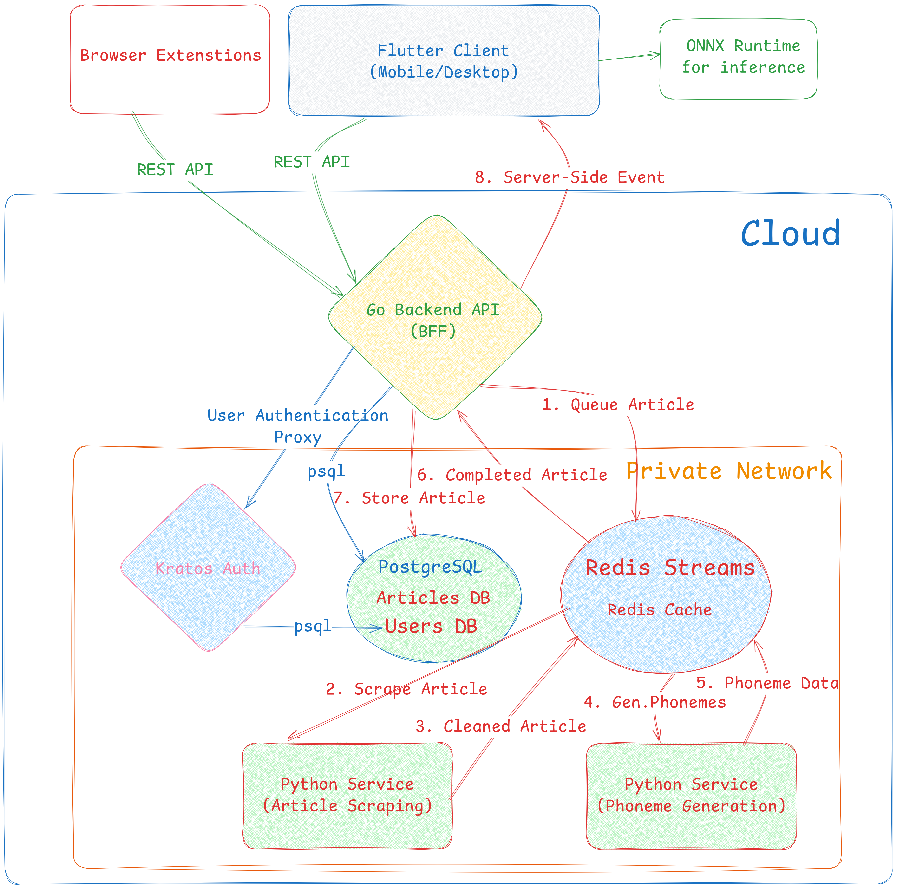

# Bachelor Project Proposal

**Project Title: Read Intent**

**Author: Ilia Gogotchuri**

**Supervisor: Shota Gvinepadze**

**Date: 17.03.2026**

## Proposal Structure:
1.  Product Short Description
2.  Background and Motivation
3.  Current Market and Demand
4.  Existing Solutions and Novelty
5.  Product Features
6.  Software Architecture

## 1. Product Short Description
 **Read Intent** - A Read-it-later application for saving, reading, and listening to web content, primarily articles.

 Users can save articles through a browser extension, a direct URL, or RSS feed, and the app will clean up and sanitise the content, removing all Ads and unnecessary distractions. The cleaned-up content will be made available offline on your devices.
The app will run text-to-speech directly on-device and generate high-quality audio articles offline. Generating a podcast-like experience from the content YOU want to consume.
**The core idea is intentional reading**: choose where you want to focus your attention, rather than have it chosen for you by algorithms.

## 2. Background and Motivation

**The internet has gotten worse** over the last few years, and the trend suggests it will only get worse from here. The word of the year in 2025 has been ["Slop"](https://www.merriam-webster.com/wordplay/word-of-the-year).

[Europol reports](https://www.europol.europa.eu/cms/sites/default/files/documents/Europol_Innovation_Lab_Facing_Reality_Law_Enforcement_And_The_Challenge_Of_Deepfakes.pdf) estimated that up to 90% online contents could be generated synthetically by the end of 2026.

Social media algorithms further incentivize and amplify the generation of such low-quality content, since the only relevant metric is engagement. Social media is pushing sensational, low-quality, and often fake content, and the content with any substance often gets lost in the informational chaos.

Oxford's Word of the Year 2024 has been ["Brain rot"](https://corp.oup.com/news/brain-rot-named-oxford-word-of-the-year-2024/) - "refers to the cognitive decline and mental exhaustion experienced by individuals, particularly adolescents and young adults, due to excessive exposure to low-quality online materials, especially on social media" ([PMC11939997](https://pmc.ncbi.nlm.nih.gov/articles/PMC11939997/)). The research shows it "leads to emotional desensitization, cognitive overload, and a negative self-concept".

Habitual consumption of negative news ("doomscrolling") is associated with elevated levels of [existential dread and anxiety](https://www.sciencedirect.com/science/article/pii/S245195882400071X).

Making healthy choices is difficult when instant gratification is one tap away and quality content requires active hunting.

**People are starting to push back.** Studies from multiple sources report an increase in digital burnout. Although the numbers vary significantly, the trend is increasing.

[A study in UK by Deloitte](https://www.deloitte.com/uk/en/about/press-room/gen-zs-favour-social-media-ban-for-under-16s-as-digital-fatigue-hits.html) - Illustrates the GenZs active disdain of social media, with one of the points being - "One in five (20%) consumers have deleted a social media app in the past 12 months, rising to one in three (29%) among Gen Zs;" And the "chronically offline" movement is gaining traction - 50% of 2,000 surveyed Americans reported intentionally make time to disconnect, with Gen Z and millennials leading at 63% and 57% respectively.

I have deleted all social media at the start of 2026, choosing to engage only with long-form content: books, documentaries, and podcasts. What I noticed immediately was the absence of a "default action" when you pick up your phone - the gut reaction is to open *your favorite social media* app, with little to no way of replacing this habit with something positive offering the same level of (low) friction.

**Audio content consumption on the rise** - Audio content consumption is steadily rising, gaining traction after the COVID era. The Audible revenue is at [an all-time high](https://appfigures.com/resources/insights/20240927?f=3). In the US, 40% of adults now listen to podcasts weekly, up from just 17% from 2018 ([Edison Research, 2025.](https://podcastatistics.com/)). This shows a clear demand for audio-form content as a primary way to consume information, especially during commuting and other screen-free moments.

The three trends above indicate an opening for a product that allows intentional consumption of a high quality content in an audio form. And articles from trusted sources and authors are the best way to acquire condensed knowledge from people who spent their time researching and thinking about issues and fields you care about.
*Read Intent is based on the idea that this content should require minimal effort to find, save and listen to.*

## 3. Current Market and Demand
Mozilla [shut down Pocket](https://support.mozilla.org/en-US/kb/future-of-pocket) in 2025 despite having more than 1 billion saved articles and 10 million active users. In their announcement, they mentioned a strategic shift to channel resources into projects that better match current browsing habits, with a stronger focus on AI and browser-native features.

The shutdown has caused an outcry from the user community across multiple social media. Users expressed frustration at losing the product they used daily and began searching for alternatives. If we follow discussions at the time (in July), there have been almost no alternatives that filled the same niche. Although some newer products have been introduced since then, none has taken the same place of being a simple, listening-focused, read-it-later app, and the gap in the market still exists.

*My research of the market is primarily based on the personal experience, surveying people I know who used Pocket or Matter, examining existing alternatives, and observing user reactions following Pocket's shutdown. I have not conducted formal market experiments.*

None of the existing alternatives satisfies all the criteria for a simple, focused read-it-later app. Some have overly complex interfaces, others are bloated with features that distract you from the main goal of consuming content. To save and listen to articles, you should not need to learn and adapt to an entirely new system. Also, Existing alternatives are aggressively pushing AI features (summarization, chatbots, auto-tagging), and there is a growing segment of users who want their tools without AI. This market is underserved currently.

On the audio generation side, the global text-to-speech software market is valued at approximately $3.71 billion, with projections of growth to $12 billion by 2033. While it is difficult to translate this directly into the read-it-later niche, it is yet another signal from the market of demand for audio-form content. Recent advance in small, efficient transformer-based TTS models now make it possible to generate high-quality audio directly on a mobile device, significantly reducing infrastructure costs.

## 4. Existing Solutons and Novelty

The closest existing solutions in *read-it-later* space are:

**Instapaper** - The most similar product to what *Read Internt* aims to be. It has all the features, but most of them are behind a paywall. It has a listening feature, but audio generation (even the paid, faster version) is slow and not in real time. The application has existed since 2008, and the user interface has not been modernized in over a decade, making it nonergonomic to use. Still, it has 500K+ users. Revenue is not public.

**Matter** - Well-regarded app, popular in professional circles. Matter has a polished and ergonomic interface. It is deliberately focused on perfecting the native iOS performance and UI and has indicated multiple times that they do not plan on expanding to multiple platforms. They have close to 100k users with revenue close to $2M in 2025.

**Speechify** - A general-purpose application for converting multiple types of text-based media to audio, with a wide variety of celebrity voices. Speechify hardly classifies as a *read-it-later* app, and has no streamlined flow for saving article content. However, their success is encouraging - having 50M+ users and $17.6M ARR.

**Readwise (Reader)** - Primarily a research and note-taking tool that works on many content types. The discovery and consumption of articles isn't the main focus, and they have a steeper learning curve. They have 100K+ users.

Overall, none of the solutions above combine a simple, distraction-free reading experience with a primary focus on listening.
These are not new products. Instapaper has existed since 2008, they have not inovated in a long time and pushed out features in a rush after the Pocket shutdown. Matter has deliberately focused on the IOS experience. Speechify and Readwise solve slightly different problems.

The feature gap is there because the existing solutions focus on different niches, and if they pivot their products more toward the "Pocket problem" that will only be indication that the market is there.

Read Intent will be designed from day one as a listening-first app with offline TTS and a lightweight architecture. On-device audio inference will drastically reduce infrastructure costs, allowing us to experiment with features and different user segments for longer without burning cash.
The demand is there - We simply need to find the right mix of ingredients.

## 5. Product Features

*Read Intent* will primarily be an Android application written in Flutter, which will allow easy porting to different platforms - IOS, Desktop, and Web.

*The core feature will be:*

- **Article Saving and Parsing** - Users can save articles to the inbox via browser extension, direct URL input, or RSS feed. Backend services will parse and clean up the article content, stripping ads, popups, and unnecessary page elements producing a distraction-free version. Parsed content is downloaded and made available offline, along with server-side-generated high-quality phonemes, allowing offline TTS with correct pronunciation even for obscure words.
- **Article Inbox and Management** - A clean inbox of saved articles with favoriting, archiving, and general CRUD operations.
- **RSS Subscription** - Users can subscribe to high-quality RSS feeds for content discovery. Instead of relying on algorithms, users choose their own sources. The app will support feed suggestions and polling for new content notifications. (The last part might be extra)
- **On-Device Text-To-Speech and Audio Player** - The primary way to consume content in Read Intent. The app will generate high-quality audio directly on the device using the [*Kokoro 82M*](https://huggingface.co/hexgrad/Kokoro-82M) TTS model. Phoneme generation will be done server-side to optimize pronounciation for difficult words. The audio player will support standard playback controls, including forward (up to buffer), rewind, and speed adjustment.
- **Authentication** - Basic Email and Password with verification and recovery, along with SSO with Google.
- **Browser Extensions** - Plugin for at least one major browser for the start to save articles with one click. Hopefully, multiple browsers.

*Nice to have extras (If time allows):*

- **Text highlighting and tagging** - Allowing users to save their favorite section for later review.
- **Full-Text Search** - Search content in all saved articles. Semantic search would also be really nice.
- **Listening Queue** - A dedicated queue for ordering and managing articles for hands-free, continuos listening experience, similar to podcasts or audiobooks.

## 6. Software Architecture

Structural Components - High-level overview:

- **Frontend** - Flutter. Single codebase targeting mobile and desktop (web might be challenging due to semantic differences when using inference). The TTS model [Kokoro 82M](https://huggingface.co/hexgrad/Kokoro-82M) running via [ONNX Runtime](https://onnxruntime.ai/) using native FFI compilation for high performance.
- **Web Extension** - JS. Using displayed QR or codes for authentication via the Flutter app. Has a simple purpose of POSTing the saved article to the BFF.
- **Backend API** - Serving as a Backend-For-Frontend - central gateway for all client-side interactions, including managing Articles. Written in Go. Exposes REST API with OpenAPI spec. Handles the first and the last parts of the article submission, putting it on the processing queue in Redis Streams, and once the article is processed, stores it into the database and notifies the clients using SSE.
- **Article Scraper Service** - Python. Responsible for fetching and cleaning the articles in the processing queue. Uses [Trafilatura](https://trafilatura.readthedocs.io/en/latest/index.html) for content extraction. For articles with dynamic content with complex JavaScript interactions, and rendering, runs a headless browser [nodriver](https://ultrafunkamsterdam.github.io/nodriver/)
- **Phoneme Generator Service** - Python. Takes the cleaned article from the processing queue and generates the phoneme sequence, using [Misaki](https://pypi.org/project/misaki/) as a primary engine and falling back to [espeak-ng](https://github.com/espeak-ng/espeak-ng) as necessary for more obscure words. This phoneme sequence will be downloaded along with the article with word-level annotations and be used for the audio generation by the Flutter frontend.
- **Authentication** - I have many options here, but will likely go with self-hosted open-source [Ory Kratos](https://www.ory.sh/kratos/). All auth routes will be proxied through the Go BFF API.
- **Database** - PostgreSQL for all persistence.
- **Message Queue and Caching** - Redis cache and Redis Streams for event-driven communications between services.

Rough architectural diagram below. This only demonstrates relationships and the main flow between the components. The actual infrastructure setup will likely involve more than a single server.

**NOTE**: This document was edited using [StackEdit](https://stackedit.io/app#).
**NOTE 2**: The Grammarly was used for grammar and spelling checks, but the suggestions were manually reviewed and applied.